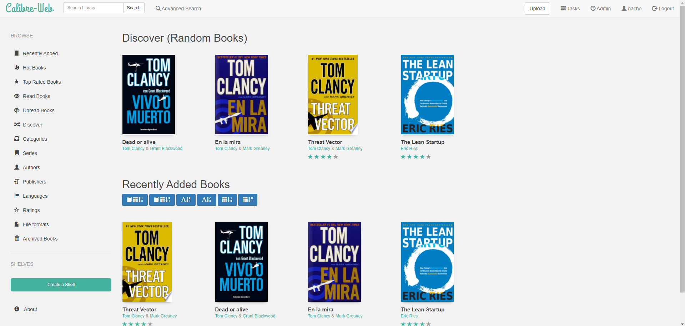

## Calibre Web
This docker-compose enable you to deploy Calibre Web. You can find more information about Calibre Web clicking [here](https://github.com/janeczku/calibre-web)

Project structure:
```
.
├── docker-compose.yaml
└── README.md
```

[_docker-compose.yaml_](docker-compose.yml)
```
version: "2.1"
services:
  calibre-web:
    image: linuxserver/calibre-web
    container_name: calibre-web
    environment:
      - PUID=1000
      - PGID=1000
      - TZ=America/Montevideo
      - DOCKER_MODS=linuxserver/calibre-web:calibre
    volumes:
      - ./config:/config
      - ./books:/books
    ports:
      - 8083:8083
    restart: unless-stopped  
```
After deploy this recipe, you're able to connect and configure Calibre Web heading your browser to http://localhost:8083.

## Deploy with docker-compose

```
Creating network "calibre-web_default" with the default driver
Pulling calibre-web (linuxserver/calibre-web:)...
latest: Pulling from linuxserver/calibre-web
535c8ed3b1af: Already exists
ae3b337f1695: Already exists
e5d2bf9d176a: Already exists
9f2240393ace: Already exists
f24bcc74ac70: Pull complete
27efdfcac130: Pull complete
Digest: sha256:be9512dcc11684a967b7ed998623771fdcef5e0b3ddc3716769338d34d688c09
Status: Downloaded newer image for linuxserver/calibre-web:latest
Creating calibre-web ... done

```

## Expected result

Check containers are running and the port mapping:

```
$ docker ps

CONTAINER ID        IMAGE                     COMMAND                  CREATED             STATUS                          PORTS                    NAMES
e9e6488498ca        linuxserver/calibre-web   "/init"                  51 seconds ago      Up 49 seconds                   0.0.0.0:8083->8083/tcp   calibre-web

```



## Stop and remove the containers

```
$ docker-compose down
```

To delete all data, remove all named volumes by passing the `-v` arguments:

```
$ docker-compose down -v
```