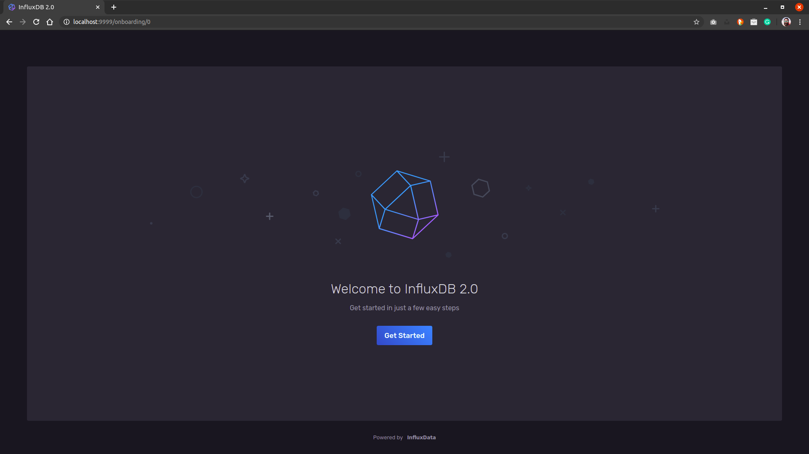

## InfluxDB v2 Beta
This docker-compose enable you to deploy a InfluxDB v2 Beta. I talk about it in this [Twitch Video](https://www.twitch.tv/ignaciovandroogenbroeck)

Project structure:
```
.
├── docker-compose.yaml
└── README.md
```

[_docker-compose.yaml_](docker-compose.yml)
```
services:
  influxdb:
    container_name: influxdb
    image: quay.io/influxdb/influxdb:2.0.0-beta
    volumes:
      - ./influxdb:/root/.influxdbv2/
    ports:
      - 9999:9999
    networks:
      - "viernes"

networks:
  viernes:
    external: true
```
After deploy this recipe, you're able to connect and configure InfluxDB connecting to http://localhost:9999. Note that this recipe will create a folder called "influxdb" to persist the data of the container.

## Deploy with docker-compose

```
$ docker compose up -d
Creating influxdb ... 
Creating influxdb ... done
```

## Expected result

Check containers are running and the port mapping:

```
$ docker ps

CONTAINER ID        IMAGE                                  COMMAND                  CREATED             STATUS              PORTS                    NAMES
f0f17daa5b49        quay.io/influxdb/influxdb:2.0.0-beta   "/entrypoint.sh infl…"   44 seconds ago      Up 34 seconds       0.0.0.0:9999->9999/tcp   influxdb
```



Stop and remove the containers

```
$ docker-compose down
```

To delete all data, remove all named volumes by passing the `-v` arguments:

```
$ docker-compose down -v
```